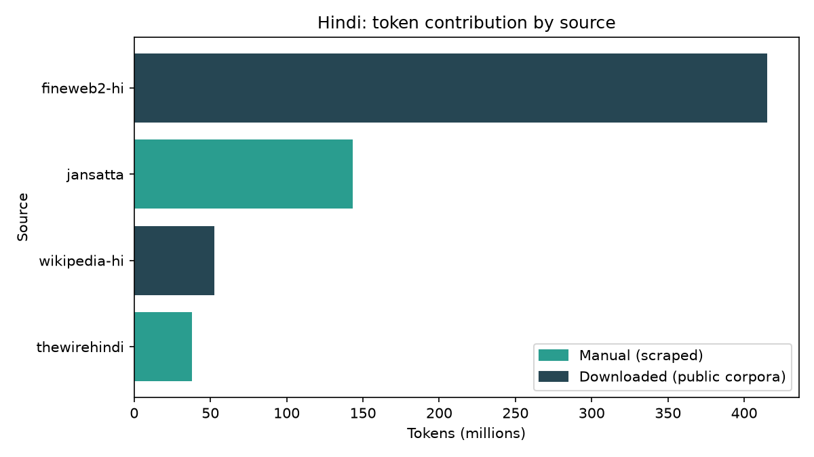
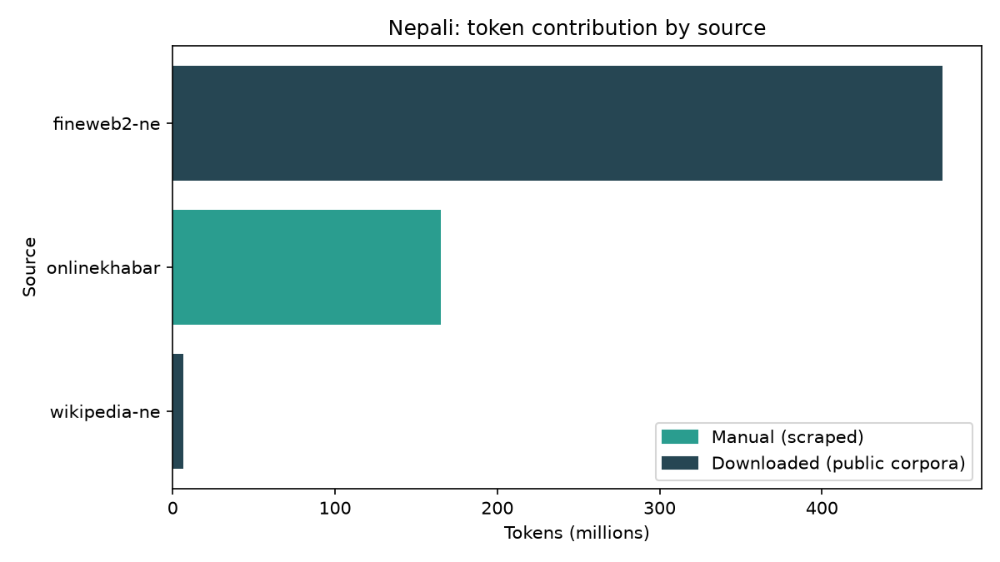
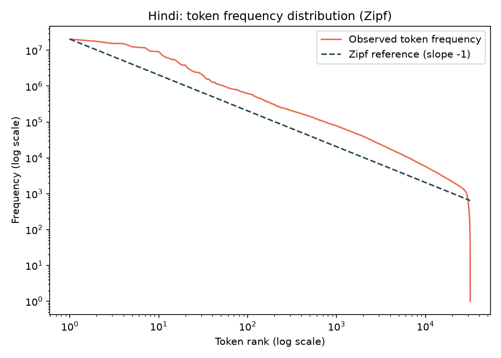
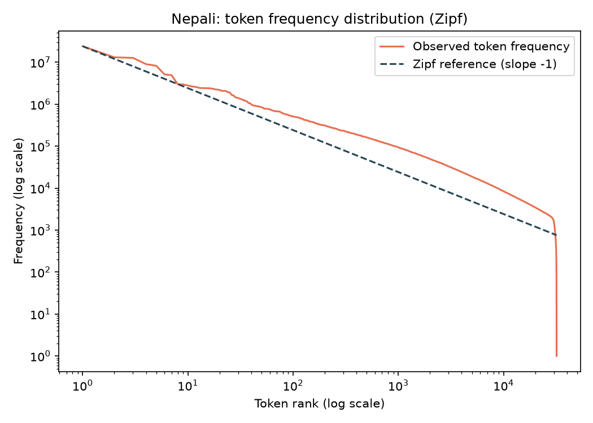
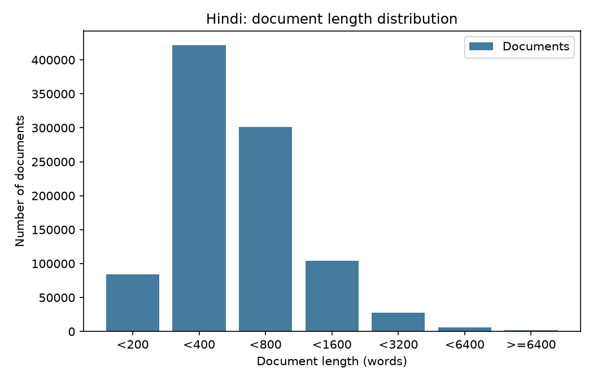
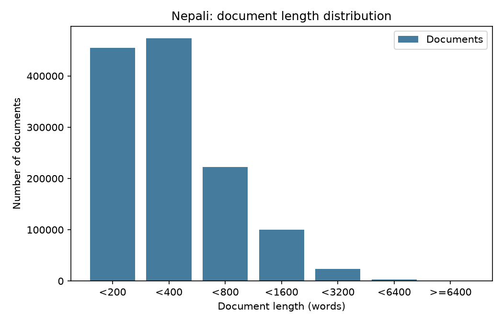
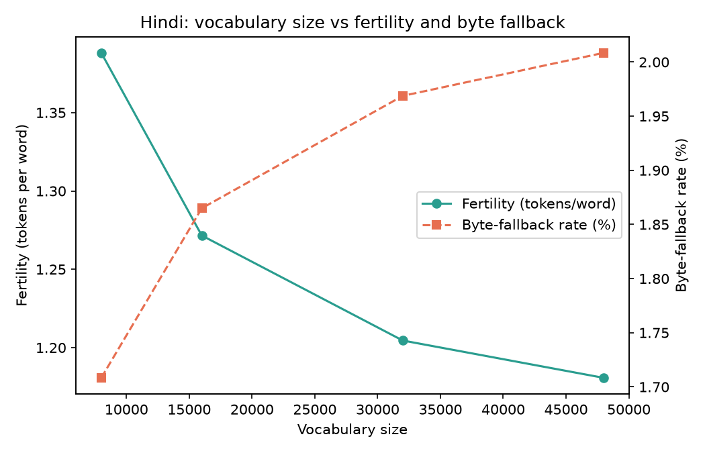
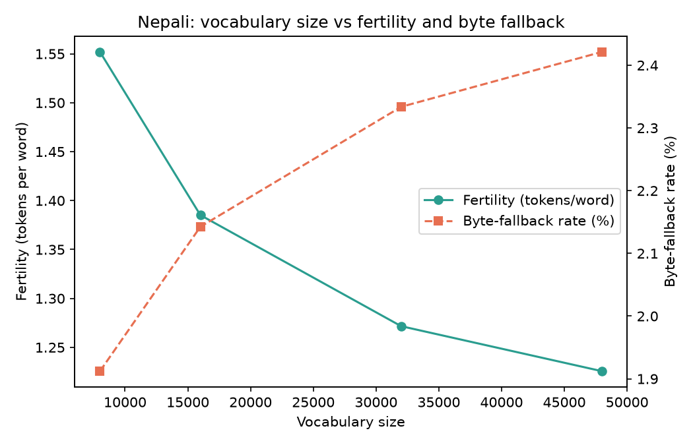

# Phase 1 — Data Collection and Tokenizer Construction

Language Models and Agents, Monsoon 2026 — Individual Project.

Two independent monolingual corpora and two independently trained tokenizers, for a
higher-resource Indian language (Hindi, Model H) and a lower-resource one (Nepali,
Model L). No data, vocabulary or artefact is shared between them.

---

## 1. Language selection

**Model H — Hindi.** The largest public monolingual text volume of any Indian language:
FineWeb-2's `hin_Deva` split alone is 34.4 GB across ~22.1M documents. It also has a deep,
openly accessible news web, which matters for the manual-collection requirement.

**Model L — Nepali**, from the assignment's permitted list.

Both use **Devanagari**, and that pairing is deliberate. Choosing languages with different
scripts would confound the comparison the project is built around: any difference between
Model H and Model L could be attributed to the writing system rather than to the amount
and quality of available data. With the script held constant, the remaining differences
are resource-level differences.

The cost is that language identification becomes genuine work rather than a character-range
check, since Hindi, Nepali, Marathi, Bhojpuri, Maithili and Sanskrit all share Devanagari.
Section 4 quantifies that cost.

---

## 2. Final corpus statistics

All token counts are **measured**, produced by encoding each corpus with the tokenizer
trained on it — not estimated from word counts.

| | Hindi (Model H) | Nepali (Model L) |
|---|---|---|
| Documents | 1,063,900 | 1,331,446 |
| Words | 587,959,968 | 527,408,637 |
| Characters | 2.97B | 3.40B |
| **Tokens** | **768,048,386** | **746,342,222** |
| **Manual tokens** | **214,243,269** | **163,321,796** |
| **Manual share** | **27.89%** | **21.88%** |
| Target ~500M tokens | ✅ +54% | ✅ +49% |
| Requirement ≥20% manual | ✅ | ✅ |

The two corpora came out close in token count (768.0M vs 746.3M, 2.9% apart), which is
convenient for later phases: differences in model behaviour will reflect data *quality and
diversity* rather than sheer quantity.

### 2.1 Composition by source

| Language | Source | Type | Documents | Tokens |
|---|---|---|---|---|
| Hindi | FineWeb-2 (`hin_Deva`) | downloaded | 601,035 | ~415M |
| Hindi | Jansatta | **manual** | 265,171 | ~143M |
| Hindi | Wikipedia (`20231101.hi`) | downloaded | 43,622 | ~52M |
| Hindi | The Wire Hindi | **manual** | 37,470 | ~38M |
| Nepali | FineWeb-2 (`npi_Deva`) | downloaded | 930,221 | ~477M |
| Nepali | Onlinekhabar | **manual** | 340,918 | ~168M |
| Nepali | Wikipedia (`20231101.ne`) | downloaded | 7,344 | ~5M |

CC-100 was intended but is unusable: its HuggingFace loader is script-based and dataset
scripts no longer execute. FineWeb-2 supersedes it — larger, more aggressively filtered
and already deduplicated. AI4Bharat Sangraha is configured but was never reached, because
the token budget filled from Wikipedia and FineWeb-2 first.

---

## 3. Manual collection (the ≥20% requirement)

The assignment requires at least 20% of final training tokens to be collected rather than
downloaded. We satisfied this entirely by **scraping**; OCR was evaluated and rejected as
too slow per token for the volume required.

### 3.1 Method

Sitemap-driven HTML scraping was the initial approach and proved poor. Testing revealed:

- **Amar Ujala's** deep archive pages are paywalled stubs — real text truncated behind
  "watch a video advertisement to continue".
- **Navbharat Times'** site-wide sitemap lists only section landing pages, with no article
  prose. All 40 test pages were correctly rejected by the quality gate.
- **Setopati's** sitemap indexes only categories, tags and authors — no articles.

The approach that worked is the **WordPress REST API**. Sites running WordPress expose
`/wp-json/wp/v2/posts`, returning complete article bodies as structured JSON:

- **100 articles per request** instead of one page per request, so a 150,000-article
  archive costs ~1,500 requests rather than 150,000.
- **The body arrives already isolated** — no navigation, advertisements or related-story
  boxes to strip.
- **Far gentler on the site**, which matters when collecting at volume.

Collection is parallelised by splitting each archive into monthly windows, fetched
concurrently by eight workers. Each window writes its own shard file, and files are renamed
into place only on successful completion — so the existence of a shard *is* the record that
its window finished. An interrupted run leaves a `.tmp` file that the next run discards and
redoes; completed windows are skipped. This made the collection restartable across the
several sessions it actually took.

### 3.2 Sources collected

| Language | Site | Documents | Coverage |
|---|---|---|---|
| Hindi | Jansatta | 266,296 | 71 of 152 monthly windows |
| Hindi | The Wire Hindi | 37,480 | all 115 windows |
| Nepali | Onlinekhabar | 354,793 | all 157 windows (archive exhausted) |

### 3.3 A source deliberately excluded

**eKantipur**, Nepal's largest daily, was dropped. Its `robots.txt` carries the Cloudflare
*content-signals* preamble, whose stated purpose is reserving rights against the `ai-train`
use case. No explicit signal value is set, so nothing is formally forbidden — but the
intent is unambiguous, and collecting from it to train a language model is not worth the
ambiguity. It also publishes no usable sitemap.

### 3.4 Protecting the manual share through deduplication

Scraped news articles also appear inside FineWeb-2, which crawled the same sites. Naive
deduplication would delete the manually collected copy and silently erode the very share
the assignment requires.

The pipeline therefore reads **manual shards before downloaded shards**, and deduplication
keeps whichever copy it encounters first. Every document also carries a `source_type` field
stamped at collection time, which survives cleaning, splitting and tokenization — so tokens
can be attributed back to their origin at the end. Without that field the 20% claim would
be unprovable, and it cannot be reconstructed after the fact: a cleaned Hindi paragraph
carries no trace of whether it came from a scraper or a public corpus.

---

## 4. Preprocessing pipeline

Order of operations, and the reason for each position:

1. **Manual documents first** — so they win deduplication ties (§3.4).
2. **Unicode normalisation** — before hashing, so that two copies differing only in
   encoding are recognised as the same document.
3. **Foreign-line removal** — before the quality gate, since removing boilerplate can drop
   a document below the length threshold.
4. **Language identification** — batched, after normalisation.
5. **Deduplication** — last, so hashes are computed on final text.

### 4.1 Unicode normalisation

Devanagari can encode the same visible character in more than one way, and web text
contains all the variants. Left unresolved, the tokenizer would learn several spellings of
the same word, splitting probability mass and wasting vocabulary a low-resource model
cannot spare.

- **NFC normalisation**, which unifies nukta forms: क़ ख़ ग़ ज़ ड़ ढ़ फ़ य़ each exist both as a
  single precomposed codepoint (U+0958–U+095F) and as base letter + nukta (U+093C).
- **Zero-width joiners removed** (ZWJ U+200D, ZWNJ U+200C) — invisible, inconsistently
  applied, and otherwise producing distinct tokens for identical-looking words.
- **Punctuation variants collapsed** — curly quotes, dashes, ellipses. The danda `।` and
  double danda `॥` are preserved as genuine Devanagari sentence punctuation.
- **Devanagari digits ०–९ are NOT converted** to ASCII. Nepali uses them throughout,
  including in dates, and rewriting them would distort the language being modelled.

### 4.2 Language identification

fastText `lid.176` was used, applied in batches of 2,000 documents. Accuracy was validated
against ground truth rather than assumed: the scraped corpora are known-language by
construction, since a Nepali news site publishes Nepali.

| Validation set | Accepted at confidence ≥0.5 | Mean confidence |
|---|---|---|
| Hindi manual (n=3,000) | **100.0%** | 0.988 |
| Nepali manual (n=3,000) | **99.9%** | 0.772 |

Nepali's lower confidence is expected — it sits closer to Hindi in the classifier's space.

**The measured contamination asymmetry is the headline finding of this section:**

| | Documents removed as wrong-language |
|---|---|
| Hindi | **31** |
| Nepali | **7,832** |

A 250× difference. Hindi's corpus was already almost pure; Nepali's carried a persistent
Hindi contamination that no character-range check could have caught, because both use
identical Unicode ranges. This is the concrete cost of the shared-script design decision,
and it is exactly the kind of tokenizer/corpus factor Phase 3 asks about.

Residual language distribution after filtering:

- **Hindi:** 953,414 `hi`, 13 `mr`, 3 `ne`, 2 `en`, 2 `gu`, 2 `sa` — 99.996% pure
- **Nepali:** 1,322,443 `ne`, 3,254 `hi`, 3 `sa`, 2 `mr`

### 4.3 Foreign words versus foreign lines

Latin script appears in both corpora, but very differently:

| | Latin share of letters | Documents containing any Latin |
|---|---|---|
| Hindi | 1.58% (manual), 2.85% (downloaded) | **61.9%** |
| Nepali | 0.07% (manual), 0.62% (downloaded) | **2.9%** |

Hindi journalism code-mixes heavily — English party names, brands and headline prefixes.
Nepali journalism transliterates foreign names into Devanagari instead.

We therefore distinguish two cases. **Foreign words are kept**; `नया iPhone लॉन्च हुआ` is
real Hindi, and deleting the English word would leave an ungrammatical fragment while
erasing a genuine property of the language. **Foreign lines are dropped** — lines whose
letters are more than 80% Latin and which contain at least four words. Inspection showed
these are consistently extraction residue rather than prose:

```
Best Affordable 108MP Camera Smartphones
KODAK 32 inches Special Edition Series HD Ready Smart LED TV 32SE5001BL
Karizma XMR vs Yamaha R15 V4 comparison
```

Cost of this filter, measured: **0.076%** of Hindi manual words and **1.44%** of Hindi
downloaded words. That downloaded data loses 19× more is itself informative — targeted
WordPress-API collection produces cleaner text than generic web-page extraction.

### 4.4 Deduplication

Two passes: **exact** (SHA-1 of the full normalised text) and **near-duplicate** (SHA-1 of
the first 300 characters with whitespace stripped).

The prefix signature is a deliberate simplification over MinHash. It catches articles
republished with different boilerplate — which share an opening paragraph — at a fraction
of the cost, and is adequate here because FineWeb-2 is already internally deduplicated, so
the main target is manual↔downloaded overlap. It will miss near-duplicates that diverge in
their opening; see §8.

### 4.5 What was removed

| | Hindi | Nepali |
|---|---|---|
| Input documents | 960,600 | 1,327,685 |
| Failed quality gate | 7,159 | 1,983 |
| Wrong language | 31 | 7,832 |
| Exact duplicates | 2,172 | 23,087 |
| Near-duplicates | 3,940 | 16,300 |
| **Kept** | **1,063,900 (98.6%)** | **1,331,446 (96.3%)** |
| Foreign lines dropped | 421,407 | 62,683 |

The quality gate requires at least 120 words on at least 3 prose lines, applied *after*
cleaning — a page extracting to 12,000 characters can reduce to 400 once whitespace
scaffolding, leaked CMS JSON and app-download boilerplate are removed. Measuring before
cleaning would wave such pages through.

---

## 5. Train / validation / test splits

98% / 1% / 1%, assigned **per document** by hashing `seed:doc_id` with seed 1337.

Splitting at document level rather than line level matters: if sentences from one article
were scattered across train and test, the model would be evaluated on text whose
surrounding context it had memorised, biasing every downstream metric.

Hash-based assignment means the partition is reproducible from the config alone, requires
no shuffling (so the corpus can be streamed), and always places a given document in the
same split.

| | Hindi | | Nepali | |
|---|---|---|---|---|
| Split | Documents | Tokens | Documents | Tokens |
| train | 928,487 | 649,135,502 | 1,252,767 | 645,993,506 |
| validation | 9,300 | 6,547,980 | 12,962 | 6,742,672 |
| test | 9,511 | 6,672,783 | 12,754 | 6,557,482 |

**Why so little held out.** In language-model pretraining every held-out document is one
the model never learns from. 1% is ~6.5M tokens, over which perplexity is already extremely
stable; the extra 9% an 80/10/10 split would reserve buys no measurement precision and
costs ~58M training tokens. The classical 80/10/10 ratio addresses small labelled datasets
where per-example accuracy needs many examples — not per-token evaluation over a million
documents.

The manual share stays consistent across splits (Hindi 28.95% / 28.63% / 27.91%),
confirming the hash assignment did not skew provenance.

---

## 6. Tokenizers

**SentencePiece BPE, trained from scratch, one per language, no shared vocabulary.**
Trained on the **train split only**, so validation and test text never influences the
vocabulary.

### 6.1 Configuration

| Setting | Value | Reason |
|---|---|---|
| `model_type` | `bpe` | |
| `vocab_size` | 16,000 | see §6.2 |
| `character_coverage` | 0.9995 | the last 0.05% is emoji and stray scripts; covering it would waste slots |
| `byte_fallback` | enabled | nothing is ever unrepresentable, so the true unknown rate is zero |
| `normalization_rule_name` | `identity` | text is already NFC-normalised by our pipeline; letting SentencePiece renormalise would undo that |
| special ids | pad 0, unk 1, bos 2, eos 3 | fixed so Phase 2 can rely on them |
| training sample | 2,000,000 lines | SentencePiece holds its corpus in RAM; subword statistics converge well before the full corpus |

With byte fallback enabled the unknown-token rate is **zero by construction**, so the
informative metric is the **byte-fallback rate** — how often the tokenizer resorted to raw
bytes — which is what we report.

### 6.2 Choosing the vocabulary size

Four candidates were trained and evaluated on held-out validation text.

**Hindi**

| Vocab | Fertility | Chars/token | Byte fallback | Vocab used | Model total |
|---|---|---|---|---|---|
| 8,000 | 1.374 | 3.659 | 1.22% | 95.9% | 20,714,176 |
| 12,000 | 1.300 | 3.867 | 1.29% | 95.7% | 22,506,176 |
| **16,000** | **1.259** | **3.992** | **1.33%** | **94.8%** | **24,298,176** |
| 24,000 | 1.216 | 4.134 | 1.38% | 91.0% | 27,882,176 ❌ |

**Nepali**

| Vocab | Fertility | Chars/token | Byte fallback | Vocab used | Model total |
|---|---|---|---|---|---|
| 8,000 | 1.548 | 4.091 | 1.93% | 97.4% | 20,714,176 |
| 12,000 | 1.442 | 4.392 | 2.08% | 97.9% | 22,506,176 |
| **16,000** | **1.381** | **4.586** | **2.17%** | **97.9%** | **24,298,176** |
| 24,000 | 1.310 | 4.837 | 2.29% | 97.3% | 27,882,176 ❌ |

**Two constraints, not one.** Fertility alone would choose the largest size for both
languages — it falls monotonically across the sweep. But vocabulary size is not free
downstream. Under weight tying the embedding matrix is `vocab_size × d_model` and is
counted once, so vocabulary trades directly against depth against the ~25M parameter
budget this project sets.

At `d_model = 448` the rest of the model costs **17,130,176** parameters. A 25,000,000
budget therefore leaves **7,869,824** for the embedding table, and

```
7,869,824 ÷ 448 = 17,566
```

is the largest vocabulary that fits. The `Model total` column above makes the consequence
concrete: 24,000 would put the model at **27,882,176** parameters — 11.5% over target — so
it was trained and measured for comparison but was never selectable.

Among the sizes that do fit, fertility is lowest at **16,000** for both languages, so it
wins outright: 1.259 tokens/word for Hindi and 1.381 for Nepali, against 1.300 and 1.442 at
12,000. Both languages therefore use **16,000**.

The cost is visible and accepted. Moving from 24,000 to 16,000 costs 3.5% fertility for
Hindi and 5.4% for Nepali — each sentence becomes a few tokens longer — in exchange for
3,584,000 parameters redirected from a lookup table into seven Transformer blocks. At this
scale that is the better trade: the table only stores what a token *is*, while the blocks
are what compose meaning.

The languages behave differently, and the difference is informative. Nepali segments less
efficiently at *every* size (1.548 against 1.374 at 8,000) and keeps higher utilisation
throughout (97.9% against 94.8% at 16,000) — it is morphologically richer, so it fills
whatever vocabulary it is given and would still benefit from more. Hindi's utilisation has
begun to fall away by 24,000 (91.0%), indicating it is closer to saturation. The budget
constraint binds first for both, but it costs Nepali more.

### 6.3 Measured tokenizer behaviour

| | Hindi | Nepali |
|---|---|---|
| Vocabulary | 16,000 | 16,000 |
| Fertility (tokens/word) | **1.306** | **1.415** |
| Characters per token | 3.87 | 4.56 |
| Unknown-token rate | 0.000% | 0.000% |
| Byte-fallback rate | ~1.33% | ~2.17% |
| Distinct tokens used | 15,876 | 15,921 |
| **Vocabulary utilisation** | **99.2%** | **99.5%** |
| Tokens appearing exactly once | 1 | 3 |

Nearly complete vocabulary utilisation, with one or two hapax tokens across 650M+ tokens,
indicates the size is well matched to the data — essentially no dead entries.

Nepali requires **5% more tokens per word** than Hindi despite an identical vocabulary size.
The composition of the vocabularies differs too:

| | Devanagari pieces | Latin-only pieces |
|---|---|---|
| Hindi | 27,772 (86.8%) | **3,141 (9.8%)** |
| Nepali | 31,553 (98.6%) | **383 (1.2%)** |

Hindi spends nearly a tenth of its vocabulary on Latin subwords — a direct consequence of
the code-mixing measured in §4.3, and a real cost of that linguistic property.

### 6.4 Most frequent tokens

**Hindi:** `▁के`, `।`, `▁है`, `▁में`, `,`, `▁की`, `<0x0A>`, `▁को`, `▁से`, `▁और`
**Nepali:** `▁।`, `,`, `<0x0A>`, `▁र`, `▁छ`, `।`, `▁पनि`, `▁छन्`, `▁भएको`, `को`

Both are dominated by function words and punctuation, as expected. The danda ranks first or
second in both, confirming it survived normalisation as intended.

### 6.5 Tokenization examples

**Hindi** — `भारत में शिक्षा का अधिकार एक मौलिक अधिकार है।`

```
['▁भारत', '▁में', '▁शिक्षा', '▁का', '▁अधिकार', '▁एक', '▁मौलिक', '▁अधिकार', '▁है', '।']
[582, 277, 1601, 295, 1127, 334, 9584, 1127, 266, 31894]
9 words → 10 tokens (fertility 1.11)
```

**Nepali** — `नेपालमा शिक्षाको अधिकार मौलिक अधिकार हो।`

```
['▁नेपालमा', '▁शिक्षाको', '▁अधिकार', '▁मौलिक', '▁अधिकार', '▁हो', '।']
[1202, 6191, 1472, 4564, 1472, 358, 31928]
6 words → 7 tokens (fertility 1.17)
```

Two things are visible. Common words are single tokens, with ids ordered by frequency
(`भारत` 582, the rarer `मौलिक` 9584). And `अधिकार` receives **1127 in Hindi but 1472 in
Nepali** — the vocabularies are genuinely independent.

`नेपालमा` ("in Nepal") is a single token with its `-मा` suffix attached, illustrating the
agglutination behind Nepali's higher fertility.

---

## 7. Figures

### 7.1 Token contribution by source

Green bars are manually collected, dark bars downloaded. Hindi's manual share comes from
two newspapers, Nepali's from a single portal whose archive was exhausted.




### 7.2 Token frequency distribution (Zipf)

The observed curve sits above a slope −1 reference through the mid-range. This is expected
for subword tokenization: BPE deliberately merges frequent character sequences, which
flattens the head relative to a word-level Zipf distribution. The sharp cliff at rank
~16,000 is the vocabulary boundary, corroborating the 99.2% / 99.5% utilisation figures —
the vocabulary is used right to its edge, with almost no dead entries.




### 7.3 Document length distribution

Hindi peaks in the 200–400 word band, reflecting a corpus dominated by news articles.
Nepali's distribution is shifted shorter — 455,280 documents fall under 200 words against
Hindi's 84,061 — because Nepali news writes tighter pieces. This is why Nepali needed more
documents (1.28M vs 947k) to reach a comparable token count.




### 7.4 Vocabulary size versus fertility and byte fallback

The evidence behind the vocabulary-size decision in §6.2. Fertility falls as vocabulary
grows while byte-fallback rate rises; both curves are still improving at 24,000, which is
exactly why the decision could not be made on fertility alone — the parameter budget, not
a plateau, is what fixes the size at 16,000.




---

## 8. Limitations

Stated plainly rather than left to be discovered.

1. **Near-duplicate detection is a prefix hash, not MinHash.** It misses near-duplicates
   that diverge within their first 300 characters. Mitigated by FineWeb-2's internal
   deduplication, but a genuine simplification.
2. **No quality classifier.** Filtering is by length, language and script heuristics.
   There is no model scoring whether text is well written, as FineWeb-2 itself applies.
3. **Manual collection is news-heavy.** Hindi manual text comes from two newspapers, Nepali
   from one portal, so the manual share carries a narrower register than the downloaded
   web crawl. Wikisource and government sources were investigated but not used.
4. **Two pretrained components are used for data cleaning** — fastText `lid.176` for
   language identification and trafilatura for HTML extraction. Neither is a language model
   nor a tokenizer, so neither falls under the assignment's prohibition, but both are
   pretrained artefacts and are declared here rather than left implicit.
5. **Token estimates during collection were initially wrong.** A placeholder fertility of
   1.8 tokens/word overstated counts by ~38%; the measured value is 1.306 (Hindi) and
   1.415 (Nepali). This was caught by training a trial tokenizer mid-project and corrected
   by collecting more data. Final counts are measured, not estimated.
6. **`corpus_stats.py` is single-threaded** where it is embarrassingly parallel — each
   shard could be encoded independently. It cost ~30 minutes that ~4 would have sufficed
   for. Worth fixing before Phase 2, where tokenization runs repeatedly.

---

## 9. Deliverables

| # | Deliverable | Location |
|---|---|---|
| 1 | Dataset collection scripts | `scripts/scrape.py`, `scripts/download.py`, `common/` |
| 2 | Preprocessing pipelines | `scripts/clean.py`, `common/normalize.py`, `common/langid.py` |
| 3 | Per-language statistics reports | this document, `report/{hindi,nepali}/*.json`, figures |
| 4 | Per-language train/val/test splits | `{hindi,nepali}/data/splits/` (Drive) |
| 5 | Tokenizer training code | `scripts/train_tokenizer.py` |
| 6 | Vocabulary files | `hindi/tokenizer/hi.vocab`, `nepali/tokenizer/ne.vocab` |
| 7 | Tokenizer model files | `hindi/tokenizer/hi.model`, `nepali/tokenizer/ne.model` |

Reproduction instructions and Google Drive links are in the top-level
[`README.md`](../README.md).
